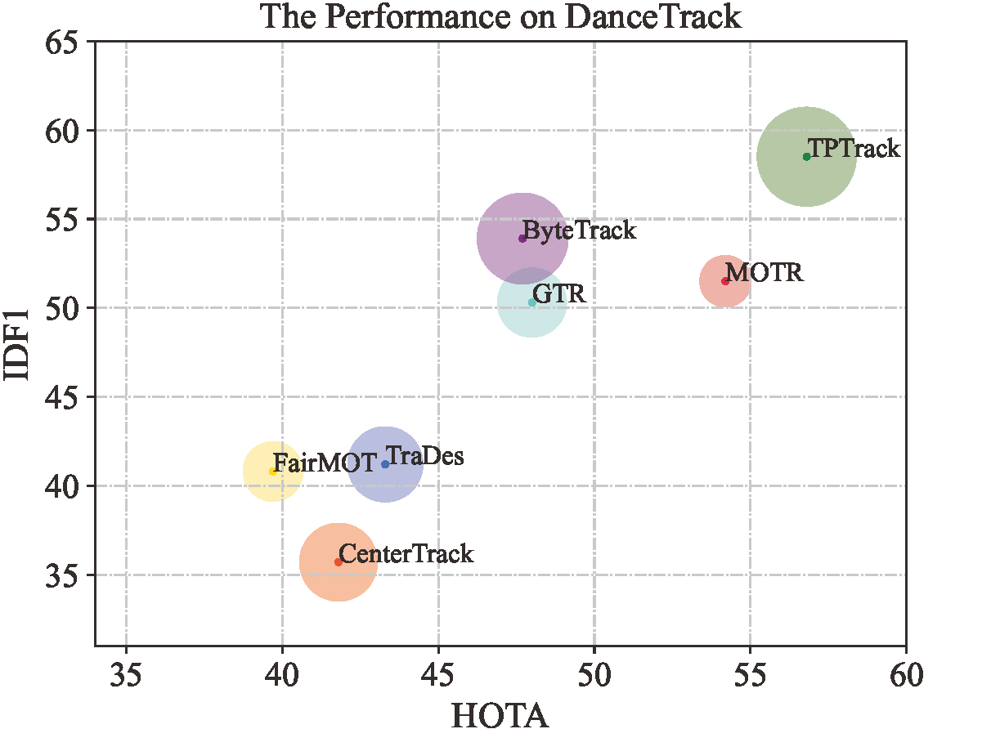

# TPTrack
**TPTrack: Strengthening Tracking-by-Detection Methods from Tracklet Processing Perspectives**

<p align="center"></p>

## Tracking performance
### Results on MOT challenge test set
| Dataset    |  HOTA | IDF1 | MOTA | AssA | DetA | IDs | FPS |
|------------|-------|------|------|-------|-------|------|------|
|MOT17       | 63.5 | 77.8 | 80.1 | 62.7 | 64.7 | 1427 | 33.7 |
|MOT20       | 61.7 | 74.8 | 76.6 | 60.4 | 63.3 | 1103 | 17.9 |
### Results on DanceTrack test set
| Dataset    |  HOTA | IDF1 | MOTA | AssA | DetA  |
|------------|-------|------|------|-------|-------|
|DanceTrack  | 63.5 | 77.8 | 80.1 | 62.7 | 64.7 |
### Results on MOT challenge and DanceTrack test set


https://github.com/godHhh/TPTrack/assets/47073050/c9897a9a-783d-426b-b25a-94ed4825b273


https://github.com/godHhh/TPTrack/assets/47073050/dc712897-405f-4358-bbbf-0cdb68027de5


https://github.com/godHhh/TPTrack/assets/47073050/9fdbb5ba-4514-478e-934d-2055593bdb08


## Installation
### Setup with Anaconda
**Step 1.** Create Conda environment and install pytorch.
```shell
conda create -n TPTrack python=3.8
conda activate TPTrack
```
**Step 2.** Install torch and matched torchvision from https://pytorch.org/get-started/locally
The code was tested using torch 1.9.1+cu113 and torchvision==0.10.1 

**Step 3.** Install TPTrack.
```shell
git clone https://github.com/godHhh/TPTrack.git
cd TPTrack
pip3 install -r requirements.txt
python3 setup.py develop
```
**Step 4.** Install [pycocotools](https://github.com/cocodataset/cocoapi).
```shell
pip3 install cython; 
pip3 install 'git+https://github.com/cocodataset/cocoapi.git#subdirectory=PythonAPI'
```
## Model Zoo
We provide pretrained model weights for TPTrack. 

| Name          | Model                                                                                                |
| --------------- |  ---------------------------------------------------------------------------------------------------- |
| DanceTrack-test |  [Google Drive](https://drive.google.com/drive/folders/1dmhvc8hbxvMfSujq4lgUA3oYaxmPD8-V?usp=sharing) |
| MOT17-half-val  |  [Google Drive](https://drive.google.com/drive/folders/1dmhvc8hbxvMfSujq4lgUA3oYaxmPD8-V?usp=sharing) |
| MOT17-test      |  [Google Drive](https://drive.google.com/drive/folders/1dmhvc8hbxvMfSujq4lgUA3oYaxmPD8-V?usp=sharing) |
| MOT20-test      |  [Google Drive](https://drive.google.com/drive/folders/1dmhvc8hbxvMfSujq4lgUA3oYaxmPD8-V?usp=sharing) |
| GlLink          |  [Google Drive](https://drive.google.com/drive/folders/1dmhvc8hbxvMfSujq4lgUA3oYaxmPD8-V?usp=sharing) |
## Data preparation

1. Download [MOT17](https://motchallenge.net/), [MOT20](https://motchallenge.net/), [CrowdHuman](https://www.crowdhuman.org/), [Cityperson](https://github.com/Zhongdao/Towards-Realtime-MOT/blob/master/DATASET_ZOO.md), [ETHZ](https://github.com/Zhongdao/Towards-Realtime-MOT/blob/master/DATASET_ZOO.md), [DanceTrack](https://github.com/DanceTrack/DanceTrack) and put them under <TPTrack_HOME>/datasets in the following structure:
    ```
    datasets
    |——————mot
    |        └——————train
    |        └——————test
    └——————crowdhuman
    |        └——————Crowdhuman_train
    |        └——————Crowdhuman_val
    |        └——————annotation_train.odgt
    |        └——————annotation_val.odgt
    └——————MOT20
    |        └——————train
    |        └——————test
    └——————Cityscapes
    |        └——————images
    |        └——————labels_with_ids
    └——————ETHZ
    |        └——————eth01
    |        └——————...
    |        └——————eth07
    └——————dancetrack        
             └——————train
             └——————val
             └——————test
    ```

2. Turn the datasets to COCO format and mix different training data:

    ```python
    # replace "dance" with ethz/mot17/mot20/crowdhuman/cityperson for others
    python3 tools/convert_dance_to_coco.py 
    ```

3. *[Optional]* If you want to training for MOT17/MOT20, follow the following to create mixed training set.

    ```python
    # build mixed training sets for MOT17 and MOT20 
    python3 tools/mix_data_{ablation/mot17/mot20}.py
    ```

## Training
You can use TPTrack without training by adopting existing detectors. But we borrow the training guidelines from ByteTrack in case you want work on your own detector. 

Download the COCO-pretrained YOLOX weight [here](https://github.com/Megvii-BaseDetection/YOLOX/tree/0.1.0) and put it under *\<TPTrack_HOME\>/pretrained*.

* **Train ablation model (MOT17 half train and CrowdHuman)**

    ```shell
    python3 tools/train.py -f exps/example/mot/yolox_x_ablation.py -d 1 -b 4 --fp16 -o -c pretrained/yolox_x.pth.tar
    ```

* **Train MOT17 test model (MOT17 train, CrowdHuman, Cityperson and ETHZ)**

    ```shell
    python3 tools/train.py -f exps/example/mot/yolox_x_mix_det.py -d 1 -b 4 --fp16 -o -c pretrained/yolox_x.pth.tar
    ```

* **Train MOT20 test model (MOT20 train, CrowdHuman)**

    For MOT20, you need to uncomment some code lines to add box clipping: [[1]](https://github.com/ifzhang/ByteTrack/blob/72cd6dd24083c337a9177e484b12bb2b5b3069a6/yolox/data/data_augment),[[2]](https://github.com/ifzhang/ByteTrack/blob/72cd6dd24083c337a9177e484b12bb2b5b3069a6/yolox/data/datasets/mosaicdetection.py#L122),[[3]](https://github.com/ifzhang/ByteTrack/blob/72cd6dd24083c337a9177e484b12bb2b5b3069a6/yolox/data/datasets/mosaicdetection.py#L217) and [[4]](https://github.com/ifzhang/ByteTrack/blob/72cd6dd24083c337a9177e484b12bb2b5b3069a6/yolox/utils/boxes.py#L115). Then run the command:

    ```shell
    python3 tools/train.py -f exps/example/mot/yolox_x_mix_mot20_ch.py -d 1 -b 4 --fp16 -o -c pretrained/yolox_x.pth.tar
    ```

* **Train on DanceTrack train set**
    ```shell
    python3 tools/train.py -f exps/example/dancetrack/yolox_x.py -d 1 -b 4 --fp16 -o -c pretrained/yolox_x.pth.tar
    ```

## Evaluation

* **on DanceTrack Test set**
    ```shell
    python tools/track.py -f exps/example/mot/yolox_dancetrack_test.py -c pretrained/tptrack_dance_model.pth.tar -b 1 -d 1 --fp16 --fuse --test --ECC --NSA --GPRI --GlLink
    ```
    Submit the outputs to [the DanceTrack evaluation site](https://competitions.codalab.org/competitions/35786). This gives HOTA = 56.8.

* **on MOT17 half val**
    ```shell
    python3 tools/track.py -f exps/example/mot/yolox_x_ablation.py -c pretrained/tptrack_ablation.pth.tar -b 1 -d 1 --fp16 --fuse --ECC --NSA --GPRI --GlLink
    ```
    We follow the [TrackEval protocol](https://github.com/DanceTrack/DanceTrack/tree/main/TrackEval) for evaluation on the self-splitted validation set. This gives you HOTA = 69.5.

* **on MOT17/MOT20 Test set**
    ```shell
    # MOT17
    python3 tools/track.py -f exps/example/mot/yolox_x_mix_det.py -c pretrained/tptrack_x_mot17.pth.tar -b 1 -d 1 --fp16 --fuse --ECC --NSA --GPRI --GlLink

    # MOT20
    python3 tools/track.py -f exps/example/mot/yolox_x_mix_mot20_ch.py -c pretrained/tptrack_x_mot20.tar -b 1 -d 1 --fp16 --fuse --track_thresh 0.4 --ECC --NSA --GPRI --GlLink
    ```
    Submit the zipped output files to [MOTChallenge](https://motchallenge.net/) system. This gives you HOTA = 63.5 on MOT17 and HOTA = 61.7 on MOT20.

## Acknowledgement 
The codebase is built upon [YOLOX](https://github.com/Megvii-BaseDetection/YOLOX) and [ByteTrack](https://github.com/ifzhang/ByteTrack). Thanks for their excellent work!
